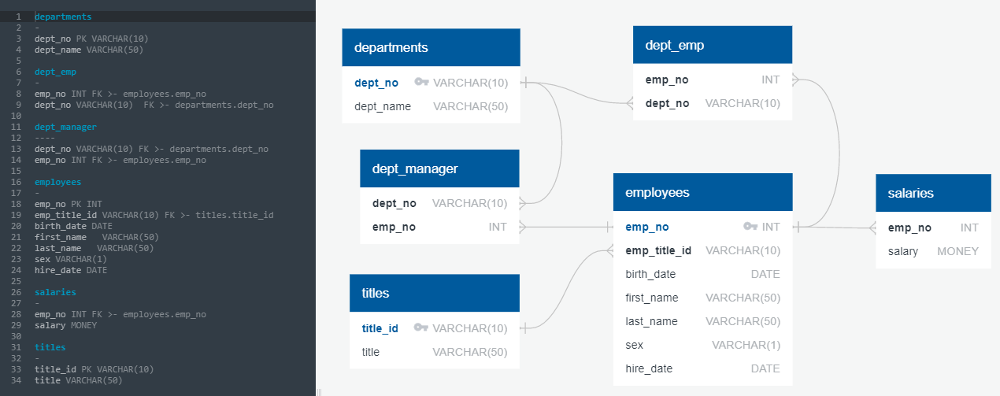
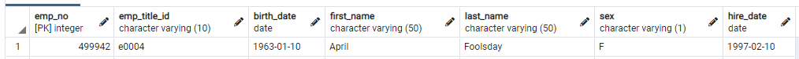

# sql-challenge

This repository demonstrates skills with data modelling, data engineering and database operations.

## Table Schema

Image below shows the schema for this exercise:

## Navigation

* **DIRECTORY: CSV_Data** - contains all the CSVs that will be loaded into the postgre Database
* **DIRECTORY: Employee_SQL** - Contains the SQL file to build the schema, the SQL queries required for the exercise and the Jupyter Notebook python script for the bonus
* **DIRECTORY: images** - contains the image for the SQL schema

## Requirements

1. Anaconda with Jupyter Notebook installed
2. Postgre SQL Server v11 or higher
3. psycopg2 installed

## Instructions

1. Run pgadmin4 and create a new database named "employees"
2. Open /EmployeeSQL/employee_schema.sql in pgadmin4 and change line 26 to the "CSV_Data" path where the repository for this challenge is copied (do not add a backslash at the end of the path string)
3. Run all the codes in the "employee_schema.sql" file
4. Open the "/EmployeeSQL/employee_sql.sql" file and run each SQL queries individually to display the responses for aech challenge.
5. Open "/EmployeeSQL/db_credentials.py" and update "user" and "password" with your Postgres username and password. (default password is "postgres")
6. "/EmployeeSQL/Open employes_analysis.ipynb" and run each code block from top to bottom - the last two blocks will show the required plots for the bonus.

## Epiloge

Apparently this was a very informative April Fool's Joke:

